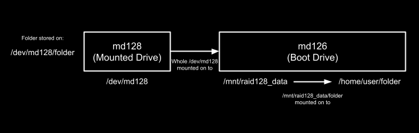

# Linux Mount Manager

**File Structure**
```txt
├── images
│   └── Linux-Mount-Structure.png
├── mount.sh.template
├── mount.service.template
├── prepare.sh
└── README.md
```

**Mount Structure** \


## Requirements
1. [Git (Recommended)](https://git-scm.com/book/en/v2/Getting-Started-Installing-Git)

## Installation
1. Git clone repository

## Running
First Time Set Up:

If you wish to implement RAID functionality, start from step 1. Otherwise, start from step 4.

1. Find available drives in your system using
```bash
    lsblk -o NAME,SIZE,FSTYPE,MOUNTPOINT
```

As seen below, nvme4n1 and nvme5n1 are available to form a virtual disk.

```txt

NAME         SIZE FSTYPE            MOUNTPOINT
nvme4n1      1.7T
nvme5n1      1.7T
nvme0n1      1.7T
├─md126      1.7T
│ ├─md126p1    1G vfat              /boot/efi
│ └─md126p2  1.7T ext4              /
├─md127        0B
├─nvme0n1p1    1G vfat
└─nvme0n1p2  1.7T ext4
nvme1n1      1.7T
├─md126      1.7T
│ ├─md126p1    1G vfat              /boot/efi
│ └─md126p2  1.7T ext4              /
├─md127        0B
├─nvme1n1p1    1G vfat
└─nvme1n1p2  1.7T ext4
```

2. Use the two available drives (nvme4n1 and nvme5n1) to form a large virtual disk with RAID1 functionality.
```bash
    sudo mdadm --create /dev/md129 --level=1 --raid-devices=2 /dev/nvme4n1 /dev/nvme5n1
```

It may take 2-3 hours for the virtual disk to be prepared.

3. Format the virtual disk to ext4.
```bash
    sudo mkfs.ext4 /dev/md129
```

4. Create a folder in the main disk (in this case md126) for the initial md129 -> md126 mounting (refer to Mount Structure image above). Thereafter, mount md129 onto md126's /mnt folder.
```bash
    sudo mkdir -p /mnt/md129
    sudo mount /dev/md129 /mnt/md129
```

5. Check that the mounting is successful using "df -h". It should now appear as follows.
```txt
Filesystem      Size  Used Avail Use% Mounted on
/dev/md126p2       x     x     x   x% /
/dev/md126p1       x     x     x   x% /boot/efi
/dev/md128         x     x     x   x% /mnt/raid128_data
```

6. Move the folders you wish to mount from your original drive (md126) to the new drive (md129).
```bash
    sudo mv /home/original_folder /mnt/md129/ # For every folder
```
Congratulations, you have completed the first time set up.

Now, and for all subsequent runs:

7. Adjust prepare.sh by modifying the settings portion.

8. Thereafter, run prepare.sh

All done! The folders that you indicated for mounting should now appear.
The mount.sh will automatically run after boot via systemctl.

## Removal
To get rid of / reverse the mounting, follow these steps.

1. Remove the deployed mount service.
```bash
    sudo systemctl stop SERVICE_NAME
    sudo systemctl disable SERVICE_NAME
    sudo rm -f DEPLOYMENT_SERVICE_FILE
    sudo systemctl daemon-reload
```

2. Remove the deployed mount script.
```bash
    sudo rm -f DEPLOYMENT_TARGET
```

3. Remove the folder mounts.
```bash
    sudo umount /home/original_folder # For every folder mounted
```
WARNING! Unmount must be done in the CORRECT order. I.e. the reverse of the mount structure diagram above.

4. Remove the added drive -> original drive mount (e.g. the /dev/md129 -> /mnt/md129 mount).
```bash
    sudo umount /mnt/md129
```
You have successfully reversed the mounting.